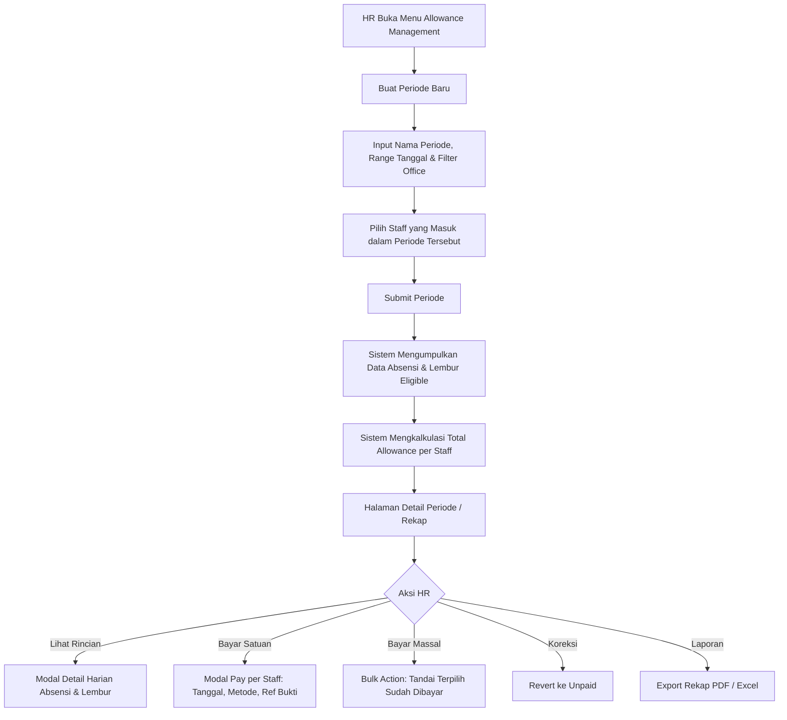
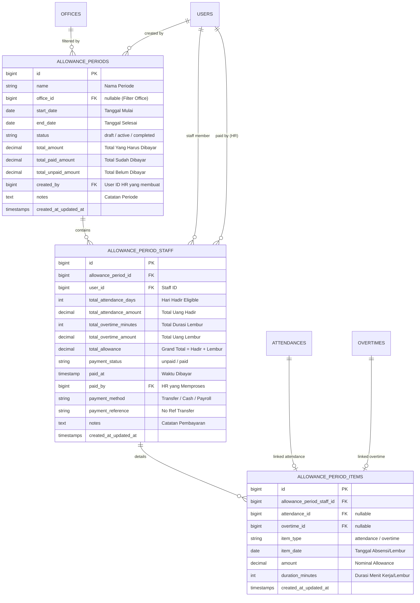

# Product Requirements Document (PRD) & Implementation Plan

# Medicare HR Allowance Management & Payment Tracking System

**Versi:** 1.0  
**Status:** Approved for Implementation  
**Target Platform:** Laravel + Livewire + Filament  
**Tanggal Dibuat:** 28 September 2026  

---

## 1. Overview & Latar Belakang

Modul **HR Allowance Management** dirancang untuk memfasilitasi tim HR dalam mengelola, merekap, memverifikasi, dan mencatat status pembayaran tunjangan (**Attendance Allowance** dan **Overtime Allowance**) bagi seluruh staff Medicare.

Di lingkungan operasional nyata, siklus penggajian/pembayaran uang saku kehadiran dan lembur memiliki karakteristik:
1. **Fleksibilitas Periode (Custom Date Range):** Tanggal cut-off bisa berbeda-beda (misal: tanggal 1 s/d 30/31, atau tanggal 15 bulan sebelumnya s/d tanggal 16 bulan berjalan).
2. **Multi-Period dalam Satu Kantor (Staff-Scoped Period):** Dalam satu kantor yang sama (misal Office A), sebagian staff (misal 10 orang) bisa dibayarkan pada periode 15 Juni – 16 Juli, sementara staff lainnya (misal 3 orang) dibayarkan pada periode 1 Juni – 30 Juni (misal karena perbedaan tipe kontrak, divisi, atau status kepegawaian).
3. **Pencatatan Status Pembayaran:** HR membutuhkan visibilitas jelas mengenai siapa yang sudah dibayar (*Paid*) dan siapa yang belum (*Unpaid*), total akumulasi yang harus dibayar, serta total yang sudah terdistribusi.
4. **Proteksi Anti Double-Claim:** Memastikan rekaman kehadiran dan lembur pada tanggal tertentu tidak dibayarkan lebih dari satu kali (*double payout*).

---

## 2. Tujuan Sistem (Goals)

1. Menyediakan fitur bagi HR untuk membuat **Allowance Period** dengan rentang tanggal fleksibel (`start_date` s/d `end_date`).
2. Mendukung pemilihan staff (*staff scoping*) per periode secara bebas (bisa *all staff*, per office, atau multi-select staff tertentu).
3. Menghitung secara otomatis hak tunjangan (**Attendance Allowance** + **Overtime Allowance**) per staff berdasarkan rekaman absensi dan lembur yang memenuhi syarat (*eligible*).
4. Menyediakan antarmuka manajemen periode di Filament dengan metrik ringkasan:
   - **Total Estimasi Biaya (Total Payable)**
   - **Total Sudah Dibayar (Total Paid)**
   - **Total Belum Dibayar (Total Unpaid / Outstanding)**
   - **Jumlah Staff Lunas vs Tertunda**
5. Memungkinkan HR mengubah status pembayaran per staff (*Mark as Paid* / *Mark as Unpaid*) dengan mencatat tanggal pembayaran, metode bayar, nomor referensi, dan catatan.
6. Menyediakan aksi massal (*Bulk Mark as Paid*) untuk mempercepat pemrosesan banyak staff sekaligus.
7. Menyediakan modal *drill-down* rincian harian absensi dan lembur per staff.
8. Menyediakan fitur ekspor rekapitulasi pembayaran (Excel & PDF) untuk kebutuhan pelaporan dan audit Finance.

---

## 3. Batasan Sistem (Non-Goals)

- Sistem ini **bukan** full payroll system (tidak menghitung BPJS, PPh 21, gaji pokok, pinjaman, atau potongan gaji lainnya).
- Sistem ini fokus spesifik pada **Attendance Allowance** (uang kehadiran) dan **Overtime Allowance** (uang lembur).
- Sistem tidak melakukan transfer bank otomatis secara langsung (pembayaran tetap dilakukan via kanal perbankan/finance, sistem mencatat status dan bukti pembayarannya).

---

## 4. Alur Kerja Bisnis (Business Workflow)



### Skenario Khusus: Multi-Period dalam 1 Office
Jika di **Office A** terdapat:
- **10 Staff** dengan periode pembayaran `15 Juni – 16 Juli`: HR membuat **Periode 1**, memilih Office A, lalu mencentang 10 staff tersebut.
- **3 Staff** dengan periode pembayaran `1 Juni – 30 Juni`: HR membuat **Periode 2**, memilih Office A, lalu mencentang 3 staff sisanya.

Kedua periode tersimpan mandiri, memiliki rekap terpisah, dan tidak saling mempengaruhi.

---

## 5. Skema Database & Relasi (ERD)



### Penjelasan Tabel:
1. **`allowance_periods`**: Menyimpan header periode pembayaran (nama, rentang tanggal, kantor, total rekapitulasi, dan status).
2. **`allowance_period_staff`**: Menyimpan ringkasan akumulasi per staff untuk periode tersebut beserta status pembayarannya (*Paid/Unpaid*).
3. **`allowance_period_items`**: Menyimpan snapshot relasi langsung ke baris `attendances` dan `overtimes` yang menjadi dasar perhitungan. Berguna untuk:
   - Audit trail detail per tanggal.
   - Mengunci record (*lock mechanism*) agar tanggal absensi tersebut tidak dapat dimasukkan ke periode lain secara ganda (*prevent double-claim*).

---

## 6. Business Logic & Validasi Perhitungan

### 6.1 Perhitungan Attendance Allowance
Untuk setiap staff dalam rentang tanggal `[start_date, end_date]`:
- Filter `attendances` dengan kriteria:
  - `user_id = staff.id`
  - `attendance_date` berada dalam rentang `start_date` s/d `end_date`
  - `allowance_eligible = true`
  - `allowance_amount > 0`
- `total_attendance_days = COUNT(eligible attendances)`
- `total_attendance_amount = SUM(allowance_amount)`

### 6.2 Perhitungan Overtime Allowance
Untuk setiap staff dalam rentang tanggal `[start_date, end_date]`:
- Filter `overtimes` melalui relasi `attendances` dengan kriteria:
  - `attendances.user_id = staff.id`
  - `overtime_date` berada dalam rentang `start_date` s/d `end_date`
  - `allowance_eligible = true`
  - `allowance_amount > 0`
- `total_overtime_minutes = SUM(overtime_minutes)`
- `total_overtime_amount = SUM(allowance_amount)`

### 6.3 Grand Total & Rekap Periode
- `total_allowance = total_attendance_amount + total_overtime_amount`
- Periode `total_amount = SUM(allowance_period_staff.total_allowance)`
- Periode `total_paid_amount = SUM(allowance_period_staff.total_allowance WHERE payment_status = 'paid')`
- Periode `total_unpaid_amount = SUM(allowance_period_staff.total_allowance WHERE payment_status = 'unpaid')`

### 6.4 Validasi Anti-Overlap (Double Payment Prevention)
Saat HR memilih staff untuk suatu periode:
- Sistem mengecek apakah ada absensi/lembur staff pada tanggal-tanggal tersebut yang sudah masuk dalam item periode lain berstatus aktif/selesai.
- Jika ada, sistem akan menampilkan peringatan dan mencegah duplikasi klaim.

---

## 7. Desain Antarmuka Filament Admin (UI/UX)

### 7.1 Menu Navigasi Filament
- **Group:** *HR Management*
- **Menu Label:** *Allowance Periods* / *Tunjangan & Pembayaran*
- **Icon:** `heroicon-o-banknotes`

---

### 7.2 Halaman List Periode (`AllowancePeriodResource`)
Tabel utama menampilkan daftar periode yang pernah dibuat:
- **Kolom:**
  1. Nama Periode
  2. Office (jika ada filter kantor)
  3. Rentang Tanggal (`start_date` – `end_date`)
  4. Jumlah Staff
  5. Total Tagihan (Rp)
  6. Total Terbayar (Rp)
  7. Total Sisa Belum Bayar (Rp)
  8. Status Periode (`Draft`, `Active`, `Completed`)
- **Actions:**
  - 👁️ **Manage / View Detail** (Masuk ke halaman rekap staff)
  - ✏️ **Edit**
  - 🗑️ **Delete** (Hanya jika belum ada staff yang berstatus *Paid*)

---

### 7.3 Halaman Pembuatan Periode Baru (`CreateAllowancePeriod`)
Form wizard / form terstruktur:
1. **Informasi Dasar:**
   - Nama Periode (misal: *Periode 15 Juni - 16 Juli Kantor Pusat*)
   - Tanggal Mulai (`start_date`) & Tanggal Selesai (`end_date`)
   - Filter Office (Dropdown opsional)
2. **Pemilihan Staff:**
   - Multi-select / Checkbox list staff dengan fitur:
     - Tombol **"Pilih Semua Staff"** (*Select All*)
     - Filter berdasarkan Office
     - Menampilkan preview estimasi hari hadir & lembur
3. **Tombol Submit:**
   - Memproses kalkulasi dan langsung mengarahkan ke halaman Manage Period.

---

### 7.4 Halaman Detail / Manajemen Periode (`ManageAllowancePeriod`)
Halaman interaktif utama untuk HR:

#### A. Top Stats Widgets (Kartu Metrik)
```
┌───────────────────────────┬───────────────────────────┬───────────────────────────┬───────────────────────────┐
│ 💵 Total Tagihan          │ 🟢 Sudah Dibayar          │ 🔴 Belum Dibayar          │ 👥 Total Staff            │
│ Rp 15.400.000             │ Rp 10.200.000 (7 Staff)   │ Rp 5.200.000 (3 Staff)    │ 10 Orang                  │
└───────────────────────────┴───────────────────────────┴───────────────────────────┴───────────────────────────┘
```

#### B. Filter Tabel Staff
- Status Pembayaran: *Semua / Belum Dibayar / Sudah Dibayar*
- Pencarian Nama / Email Staff

#### C. Tabel Staff
| Staff | Office | Kehadiran (Hari & Rp) | Lembur (Jam & Rp) | Total Allowance | Status Pembayaran | Aksi |
|---|---|---|---|---|---|---|
| **Ahmad Fauzi** | Jakarta HQ | 22 Hari (Rp 1.100.000) | 8 Jam (Rp 400.000) | **Rp 1.500.000** | 🟢 `Sudah Dibayar`<br><span class="text-xs text-gray-400">28/09/2026 by HR</span> | 🔍 Detail<br>↩️ Revert |
| **Budi Santoso** | Jakarta HQ | 20 Hari (Rp 1.000.000) | 4 Jam (Rp 200.000) | **Rp 1.200.000** | 🔴 `Belum Dibayar` | 🔍 Detail<br>💳 **Bayar** |

#### D. Aksi Per Baris (Row Actions)
1. 💳 **Bayar (Mark as Paid):**
   - Membuka modal popup dengan input:
     - Tanggal Pembayaran (default: `today`)
     - Metode Pembayaran (Transfer Bank, Tunai, Payroll)
     - Nomor Referensi Transfer (opsional)
     - Catatan (opsional)
2. ↩️ **Batalkan Pembayaran (Mark as Unpaid):**
   - Mengembalikan status ke Unpaid jika ada koreksi.
3. 🔍 **Lihat Rincian (View Daily Breakdown):**
   - Membuka drawer/modal tabel harian:
     - Tanggal, Jam Masuk, Jam Pulang, Durasi Kerja, Allowance Kehadiran.
     - Tanggal Lembur, Jam Masuk OT, Jam Pulang OT, Durasi OT, Allowance Lembur.

#### E. Aksi Massal (Bulk Actions)
- ☑️ **Bayar Terpilih Sekaligus (Bulk Mark as Paid):**
  - HR mencentang beberapa staff yang belum dibayar lalu melakukan konfirmasi bayar dalam 1 langkah.
- 📄 **Export Rekap (Excel / PDF):**
  - Mengunduh rekap siap cetak / siap kirim ke bagian Finance.

---

## 8. Rencana Implementasi Teknis (Step-by-Step Execution Plan)

### Langkah 1: Database Migrations
Membuat 3 tabel baru via artisan migration:
1. `create_allowance_periods_table`
2. `create_allowance_period_staff_table`
3. `create_allowance_period_items_table`

### Langkah 2: Eloquent Models & Relations
Membuat model:
- `App\Models\AllowancePeriod` (relasi ke `Office`, `User` creator, `AllowancePeriodStaff`)
- `App\Models\AllowancePeriodStaff` (relasi ke `AllowancePeriod`, `User` staff, `User` paid_by, `AllowancePeriodItem`)
- `App\Models\AllowancePeriodItem` (relasi ke `AllowancePeriodStaff`, `Attendance`, `Overtime`)

### Langkah 3: Service Layer (`AllowanceCalculationService`)
Membuat service untuk memisahkan business logic:
- `calculateForStaff(User $staff, Carbon $startDate, Carbon $endDate)`
- `generatePeriodSummary(AllowancePeriod $period, array $userIds)`
- `markStaffAsPaid(AllowancePeriodStaff $periodStaff, array $paymentData)`
- `markStaffAsUnpaid(AllowancePeriodStaff $periodStaff)`
- `recalculatePeriodTotals(AllowancePeriod $period)`

### Langkah 4: Filament Resource & Pages
Membuat Filament Resource:
- `App\Filament\Resources\AllowancePeriodResource`
- `Pages\ListAllowancePeriods`
- `Pages\CreateAllowancePeriod`
- `Pages\ManageAllowancePeriod` (Custom Page dengan Widget Header & Tabel Staff terintegrasi)
- `Widgets\AllowancePeriodStatsWidget`

### Langkah 5: Modal Rincian Harian & Export
- Blade view untuk modal rincian harian absensi + overtime per staff.
- Fitur export PDF / Excel menggunakan format rekapitulasi standar.

### Langkah 6: Testing & Validasi
- Pengujian skenario 1: 10 staff periode 15 Jun – 16 Jul.
- Pengujian skenario 2: 3 staff periode 1 Jun – 30 Jun di kantor yang sama.
- Pengujian aksi bayar satuan, bayar massal, revert, dan pembaruan kartu metrik otomatis.

---

## 9. Kesimpulan

Dokumen ini telah mencakup seluruh kebutuhan HR untuk manajemen periode pembayaran tunjangan, pemisahan siklus per kelompok staff, pelacakan status pembayaran *Paid* vs *Unpaid*, serta ringkasan finansial yang terstruktur. 

Rencana ini siap dieksekusi secara bertahap pada sesi pengerjaan berikutnya.
