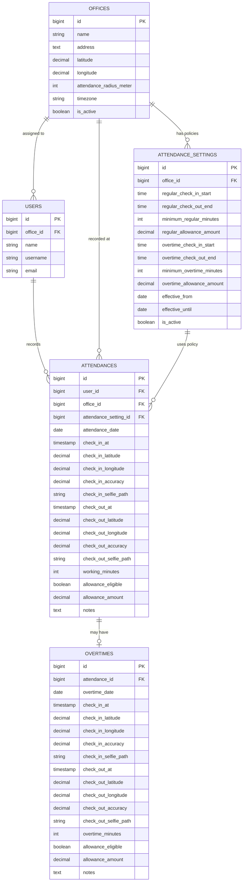

# Product Requirements Document (PRD)

## Medicare HR Attendance & Overtime System

**Version:** 1.0\
**Status:** Final Requirement Baseline\
**Platform:** Laravel + Livewire + Filament

## 1. Overview

Medicare HR Attendance & Overtime System adalah modul untuk mencatat
kehadiran staff per office, memvalidasi lokasi menggunakan
GPS/geofencing, mengambil live selfie saat check-in/check-out,
menghitung durasi kerja, menentukan attendance allowance, serta
mengelola overtime dan overtime allowance.

Sistem mendukung multiple office. Setiap office dapat memiliki lokasi,
timezone, radius geofence, attendance policy, dan nominal allowance yang
berbeda. Modul menggunakan tabel `users` existing sebagai identitas
staff.

## 2. Goals

1.  Mencatat regular attendance melalui check-in dan check-out.
2.  Menggunakan server timestamp sebagai sumber waktu resmi.
3.  Memvalidasi GPS terhadap geofence office.
4.  Mengambil live selfie pada check-in/check-out.
5.  Menghitung regular working duration.
6.  Memberikan regular allowance jika minimum regular duration
    terpenuhi.
7.  Membatasi OT hanya untuk staff yang memenuhi regular attendance
    minimum pada hari yang sama.
8.  Mencatat OT secara terpisah.
9.  Memberikan OT allowance jika minimum OT duration terpenuhi.
10. Mendukung policy berbeda untuk setiap office.
11. Menjaga historical office, policy, dan allowance.
12. Menyediakan monitoring HR/Admin melalui Filament.

## 3. Non-Goals

-   Shift management
-   Work schedule per staff
-   Excel schedule import
-   Full payroll
-   Leave/cuti management
-   Shift exchange
-   Face recognition/biometric matching
-   Multiple regular sessions per day
-   Multiple OT sessions per day

## 4. Roles

### Staff

Staff dapat melihat attendance hari ini, melakukan regular check-in/out,
melihat durasi dan allowance eligibility, melakukan OT jika eligible,
melakukan OT check-in/out, dan melihat attendance history miliknya.

### HR/Admin

HR/Admin dapat mengelola office, geofence, timezone, attendance policy,
allowance, assignment office staff, attendance monitoring, overtime
monitoring, dan melihat selfie sesuai permission.

## 5. Core Business Rules

### 5.1 Regular Attendance

Default policy: - Check-in opens: **08:00** - Check-out maximum:
**17:00** - Minimum regular duration: **360 minutes / 6 hours** -
Regular allowance: diberikan jika
`working_minutes >= minimum_regular_minutes`

Default tersebut disimpan di policy masing-masing office dan dapat
berbeda antar-office.

Regular duration hanya dihitung dari:

`check_out_at - check_in_at`

Overtime tidak boleh ditambahkan ke regular working duration.

  Check In   Check Out     Duration Regular Allowance   OT Eligible
  ---------- ----------- ---------- ------------------- -------------
  08:00      14:00               6h Yes                 Yes
  09:00      15:30           6h 30m Yes                 Yes
  10:00      16:00               6h Yes                 Yes
  11:00      17:00               6h Yes                 Yes
  11:01      17:00           5h 59m No                  No

### 5.2 Overtime

Staff hanya dapat OT apabila pada hari yang sama: 1. Regular attendance
tersedia. 2. Regular attendance sudah check-out. 3.
`working_minutes >= minimum_regular_minutes`. 4. Current office time
berada dalam overtime window.

Default OT: - OT check-in opens: **18:00** - OT check-out maximum:
**22:00** - Minimum OT duration: **120 minutes / 2 hours** - OT
allowance: diberikan jika `overtime_minutes >= minimum_overtime_minutes`

Regular allowance dan OT allowance merupakan entitlement terpisah.

## 6. Multi-Office

Setiap office memiliki: - Name - Address - Latitude - Longitude -
Attendance radius - Timezone - Active status

Staff memiliki `office_id` sebagai assigned office. Attendance tetap
menyimpan `office_id` agar historical attendance tidak berubah ketika
staff dipindahkan.

## 7. Attendance Policy

Setiap office dapat memiliki beberapa historical policy: -
`regular_check_in_start` - `regular_check_out_end` -
`minimum_regular_minutes` - `regular_allowance_amount` -
`overtime_check_in_start` - `overtime_check_out_end` -
`minimum_overtime_minutes` - `overtime_allowance_amount` -
`effective_from` - `effective_until` - `is_active`

Periode policy pada office yang sama tidak boleh overlap.

## 8. Time Handling

`check_in_at` dan `check_out_at` harus berasal dari server, bukan waktu
browser/device. Validasi window dilakukan menggunakan timezone office.

## 9. GPS & Geofencing

Setiap attendance event mencatat: - Latitude - Longitude - GPS accuracy

Backend menghitung jarak lokasi staff terhadap office dan memastikan
staff berada di dalam `attendance_radius_meter`.

Client-side geofence hanya untuk UX; backend tetap menjadi source of
truth.

## 10. Live Selfie

Live selfie digunakan pada: - Regular check-in - Regular check-out - OT
check-in - OT check-out

Camera menggunakan browser `getUserMedia()`. Gallery/file upload bukan
mekanisme utama attendance selfie.

Database hanya menyimpan path: - `check_in_selfie_path` -
`check_out_selfie_path`

Contoh path:

`attendance/2026/09/21/12/check-in.webp`

File harus berada di private storage/object storage dan diakses melalui
authorization.

## 11. Regular Check-In Flow

``` text
Login
 ↓
Load Assigned Office
 ↓
Load Active Policy
 ↓
Validate Office Local Time
 ↓
Request GPS
 ↓
Validate Geofence
 ↓
Capture Live Selfie
 ↓
Submit
 ↓
Generate Server Timestamp
 ↓
Create Attendance
```

Check-in ditolak jika office/policy tidak tersedia, terlalu awal, di
luar geofence, GPS/selfie tidak tersedia, atau attendance tanggal
tersebut sudah ada.

## 12. Regular Check-Out Flow

``` text
Existing Attendance
 ↓
Validate GPS + Geofence
 ↓
Capture Selfie
 ↓
Generate Server Check-Out
 ↓
Calculate Working Minutes
 ↓
Determine Regular Allowance
```

Jika eligible:

`allowance_eligible = true`

`allowance_amount = policy.regular_allowance_amount`

Jika tidak:

`allowance_eligible = false`

`allowance_amount = 0`

## 13. Overtime Flow

OT hanya tersedia jika regular attendance selesai dan minimum regular
duration terpenuhi.

``` text
Eligible Regular Attendance
 ↓
Inside OT Window
 ↓
GPS + Geofence
 ↓
Live Selfie
 ↓
OT Check-In
 ↓
OT Check-Out
 ↓
Calculate Overtime Minutes
 ↓
>= Minimum OT?
 ├─ No → No OT Allowance
 └─ Yes → OT Allowance
```

## 14. ERD



## 15. Database Constraints

`attendances`: - `UNIQUE(user_id, attendance_date)` - index
`(office_id, attendance_date)`

`overtimes`: - `UNIQUE(attendance_id)` - index `overtime_date`

`attendance_settings`: - index
`(office_id, effective_from, effective_until)` - application validation
mencegah policy period overlap.

## 16. Historical Integrity

Attendance menyimpan `office_id` dan `attendance_setting_id` sebagai
historical reference. `allowance_amount` juga disimpan sebagai snapshot
sehingga perubahan nominal policy tidak mengubah historical transaction.

## 17. Filament HR/Admin

Menu: - Office Management - Attendance Settings - Attendance
Monitoring - Overtime Monitoring

Attendance Monitoring minimal menampilkan staff, office, date,
check-in/out, working duration, allowance eligibility/amount, GPS, dan
selfie.

Overtime Monitoring minimal menampilkan staff, office, date, OT
check-in/out, OT duration, allowance eligibility/amount, GPS, dan
selfie.

Filter minimal: date, office, staff, allowance status.

## 18. Staff UI

Halaman attendance menampilkan: - Assigned office - Regular attendance
window - Minimum regular duration - Check-in/out status - Current/final
working duration - Regular allowance status - OT availability - OT
window - Minimum OT duration - Current/final OT duration - OT allowance
status

## 19. Security & Validation

Backend wajib memvalidasi: - Authentication - Assigned/selected office -
Active office - Active policy - Server date/time - Attendance/OT
window - Duplicate attendance - Duplicate OT - Regular completion before
OT - Minimum regular duration before OT - GPS coordinates - Geofence -
Required selfie - Allowance calculation

Foto attendance disimpan secara private dan hanya dapat diakses melalui
authorization.

## 20. Existing System Integration

Gunakan tabel `users` existing; tidak membuat tabel `employees` baru.

Existing Daily Reports, Weekly Reports, Plan of Actions, GitHub
integration, Sections, Modules/Sub Modules, serta Spatie Roles &
Permissions tidak perlu diubah untuk core attendance.

## 21. Acceptance Criteria

1.  HR dapat membuat minimal dua office dengan policy berbeda.
2.  Staff dapat di-assign ke office.
3.  Staff tidak dapat check-in sebelum regular check-in start.
4.  Check-in/out menyimpan server timestamp, GPS, accuracy, dan live
    selfie.
5.  Sistem menghitung `working_minutes`.
6.  Regular duration \>= policy minimum mendapatkan regular allowance.
7.  Regular duration \< minimum tidak mendapatkan allowance dan tidak
    dapat OT.
8.  Staff eligible dapat OT hanya dalam OT window.
9.  Sistem menghitung `overtime_minutes`.
10. OT \>= policy minimum mendapatkan OT allowance.
11. OT \< policy minimum tidak mendapatkan OT allowance.
12. Satu user maksimal satu regular attendance per tanggal.
13. Satu attendance maksimal satu overtime record.
14. Perubahan assigned office tidak mengubah historical attendance.
15. Perubahan policy/allowance tidak mengubah historical attendance.
16. HR dapat memonitor attendance dan OT melalui Filament.
17. Selfie disimpan sebagai private file path, bukan Base64/database
    binary.
18. Client/device time tidak digunakan sebagai official attendance time.

## 22. Technology

-   Laravel
-   Livewire
-   Filament
-   MySQL
-   Laravel private storage / private object storage
-   Browser Geolocation API
-   Browser MediaDevices (`getUserMedia()`)
-   Existing Spatie Permission architecture
